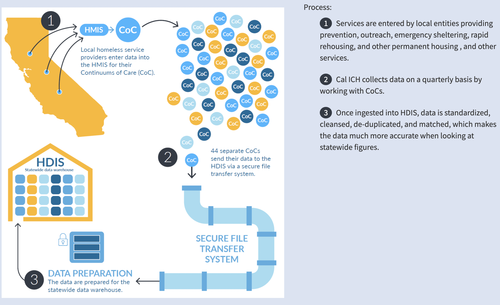

```{r setup, include=FALSE}
knitr::opts_chunk$set(
echo = TRUE,
warning = FALSE,
fig.width = 10, 
  fig.height = 5,
  out.width = "100%"
)
```
## Part1: datasets "People Receiving Homeless Response Services"

### Description of datasets



The `demo` datasets are defined as "People Receiving Homeless Response Services by Age, Race, Ethnicity, and Gender".

This data set gives annual statistics by age group, race, ethnicity, and gender on the number of people who have benefited from homelessness assistance services.

The Homelessness Data Integration System (HDIS), an extensive data repository that compiles and examines information from each of California's 44 Continuums of Care (CoC), is the source of this information. Every Community of Communities (CoC) collects and disseminates information on the people it serves via a range of programs, such as those aimed at ending homelessness, offering outreach services to the homeless, assisting with permanent housing solutions, and other projects in line with California's Housing First objectives.

-   Important Variables:

`CALENDAR_YEAR`: Calendar Year\
`LOCATION`: Location\
`ETHNICITY`: Ethnicity\
`AGE_GROUP_PUBLIC`: Age Group\
`GENDER`: Gender\
`RACE`: Race\
`EXPERIENCING_HOMELESSNESS`: Number of people receiving homelessness services

### Data Process

First, we converted all the variable names to lowercase.

Then we removed the unneeded variable "location_id", and removed the null value of "experiencing_homelessness".

Finally, we batch export and import the four cleaned csv files into datasets.

```{r, message=FALSE}
# import data
library(tidyverse)
age_demo = read.csv("./original data/demo/age_demo.csv")
ethnicity_demo = read.csv("./original data/demo/ethnicity_demo.csv")
gender_demo = read.csv("./original data/demo/gender_demo.csv")
race_demo = read.csv("./original data/demo/race_demo.csv")
head(age_demo) 
head(ethnicity_demo)
head(gender_demo)
head(race_demo)
```

```{r}
# Clean data
library(readr)
folder_path <- "./original data/demo/"
csv_files <- list.files(folder_path, pattern = ".csv")

# define a function to process a CSV file
clean_csv <- function(input_file, output_file) {
  data <- read.csv(input_file)
  data_cleaned <- data |> 
    filter(EXPERIENCING_HOMELESSNESS != "*") |>
    dplyr::select(-LOCATION_ID) |>
    janitor::clean_names() 
   write.csv(data_cleaned, file = output_file, row.names = FALSE)
   #return(data_cleaned)
}

output_folder <- "./processed data/demo/"

# process CSV files using the lapply function
cleaned_data_list <- lapply(csv_files, function(file) {
  input_file <- paste0(folder_path, file)
  output_file <- paste0(output_folder, "cleaned_", file)
  clean_csv(input_file, output_file)
})

# import clean data
age_clean = read.csv("./processed data/demo/cleaned_age_demo.csv")
ethnicity_clean = read.csv("./processed data/demo/cleaned_ethnicity_demo.csv")
gender_clean = read.csv("./processed data/demo/cleaned_gender_demo.csv")
race_clean = read.csv("./processed data/demo/cleaned_race_demo.csv")
```

### Summary

To begin with the analyzing process, we first summarize the counts and percentages of Californian homeless people from 2017 to 2023, stratified by age, ethnicity, gender, race, separately for each of the four datasets:

Dataset categorized by age:

```{r}
age_clean_for_summary = 
  age_clean |>
  dplyr::select(-location)

age_clean_for_summary |>
  group_by(age_group_public) |>
  summarize(Homelessness = sum(experiencing_homelessness)) |>
  mutate(Percent = (Homelessness / sum(Homelessness)) * 100) |> knitr::kable()
```

Dataset categorized by ethnicity:

```{r}
ethnicity_clean_for_summary = 
  ethnicity_clean |>
  dplyr::select(-location)

ethnicity_clean_for_summary |>
  group_by(calendar_year) |>
  summarize(Homelessness = sum(experiencing_homelessness)) |>
  mutate(Percent = (Homelessness / sum(Homelessness)) * 100) |> knitr::kable()

ethnicity_clean_for_summary |>
  group_by(ethnicity) |>
  summarize(Homelessness = sum(experiencing_homelessness)) |>
  mutate(Percent = (Homelessness / sum(Homelessness)) * 100) |> knitr::kable()
```

Dataset categorized by gender:

```{r}
gender_clean_for_summary = 
  gender_clean |>
  dplyr::select(-location)

gender_clean_for_summary |>
  group_by(calendar_year) |>
  summarize(Homelessness = sum(experiencing_homelessness)) |>
  mutate(Percent = (Homelessness / sum(Homelessness)) * 100) |> knitr::kable()

gender_clean_for_summary |>
  group_by(gender) |>
  summarize(Homelessness = sum(experiencing_homelessness)) |>
  mutate(Percent = (Homelessness / sum(Homelessness)) * 100) |> knitr::kable()
```

Dataset categorized by race:

```{r}
race_clean_for_summary = 
  race_clean |>
  dplyr::select(-location)

race_clean_for_summary |>
  group_by(calendar_year) |>
  summarize(Homelessness = sum(experiencing_homelessness)) |>
  mutate(Percent = (Homelessness / sum(Homelessness)) * 100) |> knitr::kable()

race_clean_for_summary |>
  group_by(race) |>
  summarize(Homelessness = sum(experiencing_homelessness)) |>
  mutate(Percent = (Homelessness / sum(Homelessness)) * 100) |> knitr::kable()
```


### Data visualization

The data visualization serves as a foundation for a more in-depth investigation by providing us with a preliminary understanding of the relationship between the variables (age, gender, ethnicity, and race) and the number of homeless people and how that relationship has evolved over time.

#### Total Homelessness by Year and Age Group
```{r}
# line plot for "Total Homelessness by Year and Age Group"
library(plotly)
age_plot <- age_clean |>
  dplyr::select(-location) |>
  group_by(calendar_year,age_group_public) |>
  summarise(total_homelessness = sum(experiencing_homelessness))

age_plot |> 
  mutate(text_label = str_c("Year: ", calendar_year, "\nAge Group: ", age_group_public)) |> 
  plot_ly(x = ~calendar_year, y = ~total_homelessness, type = "scatter", mode = "line", color = ~age_group_public, colors = "viridis", text = ~text_label, alpha = 0.8) |>
    layout(title = "Total Homelessness by Year and Age Group")
```

The above graph shows that the majority of homeless individuals who have received assistance are under the age of 18. The proportion of homeless people who have received assistance overall is higher among lower age groups. So we should pay attention to younger group to give them broader help. The overall trend of the homeless population receiving assistance is rising between 2021 and 2022, which is probably because of the potential effects of the COVID-19 pandemic.

#### Total Homelessness by Year and Ethnicity
```{r}
# bar chart for "Total Homelessness by Year and ethnicity"
ethnicity_plot <- ethnicity_clean |>
  dplyr::select(-location) |>
  group_by(calendar_year,ethnicity) |>
  summarise(total_homelessness = sum(experiencing_homelessness))

ethnicity_plot |> 
  mutate(text_label = str_c("Year: ", calendar_year, "\nEthnicity: ", ethnicity)) |>
  plot_ly(x = ~calendar_year, y = ~total_homelessness, type = "bar", color = ~ethnicity, colors = "viridis", text = ~text_label, alpha = 0.8) |>
  layout(
    title = "Total Homelessness by Year and ethnicity")
```

From the bar chart above we can see that people whose race are Hispanic/Latinx make up a large percentage of people receiving homeless response services, approximately 35%. However, based on the 2020 Census data, the Latino population in the United States totals 62.1 million, constituting 18.9% of the overall population. This demographic group stands as the second-largest ethnic or racial category in the country.So we need to focus on the vulnerable groups in ethnicity based on the problem of homelessness.

#### Total Homelessness by Year and Gender
```{r}
# bar chart for "Total Homelessness by Year and gender"
gender_plot <- gender_clean |>
  dplyr::select(-location) |>
  group_by(calendar_year,gender) |>
  summarise(total_homelessness = sum(experiencing_homelessness))

gender_plot  |> 
  mutate(text_label = str_c("Year: ", calendar_year, "\nGender: ", gender)) |>
  plot_ly(x = ~calendar_year, y = ~total_homelessness, type = "bar", color = ~gender, colors = "viridis", text = ~text_label, alpha = 0.8) |>
  layout(
    title = "Total Homelessness by Year and gender")
```

According to the bar chart by sex, we can know that the majority of people in need of assistance who are homeless are women, indicating that homelessness is a problem that affects more women than men and is rising annually for all genders from 2017 to 2022. The trend is downward and more controlled in 2023.

#### Total Homelessness by Year and Race
```{r}
# line plot for "Total Homelessness by Year and race"
race_plot <- race_clean |>
  dplyr::select(-location) |>
  group_by(calendar_year,race) |>
  summarise(total_homelessness = sum(experiencing_homelessness))

race_plot  |> 
  mutate(text_label = str_c("Year: ", calendar_year, "\nRace: ", race)) |>
  plot_ly(x = ~calendar_year, y = ~total_homelessness,  type = "scatter", mode = "line", color = ~race, colors = "viridis", text = ~text_label, alpha = 0.8) |>
  layout(
    title = "Total Homelessness by Year and gender" ,
    legend = list(
      x = 1,
      y = 0.5, 
      traceorder = "normal",
      bgcolor = "white", 
      bordercolor = "white",
      borderwidth = 0.5
    ))

# pie chart for "Percentage of Total Homeless by Race"
race_clean |>
  group_by(race) |>
  summarise(total_homelessness = sum(experiencing_homelessness)) |>
  mutate(percentage = total_homelessness / sum(total_homelessness)) |>
  plot_ly(labels = ~race, values = ~percentage, type = "pie", hole = 0.4) |>
   layout(title = "Percentage of Total Homeless by Race")
```

Based on the percantage of total homeless by race, we can see that white people accounted for the largest percentage of homeless people receiving help at 55.1%, followed by Black, Afircan American or African, the next largest group at 29.3%. This suggests that there is a relationship between race and Number of people receiving homelessness services, and that there is a need to focus on these two groups of people.

### Kruskal-Wallis test
Next, we employ hypothesis testing as a method to more accurately assess the significance of relationships between variables. Through hypothesis testing, we aim to rigorously determine whether observed associations or differences between variables are statistically significant, providing a robust means to infer the presence of genuine relationships in our data.

When data does not meet the assumption of normality and involves multiple groups, we can consider using a non-parametric method for analysis, such as the Kruskal-Wallis test. The Kruskal-Wallis test is a non-parametric test used to compare differences among three or more groups, and it is less restrictive in terms of assumptions about the distribution of the data.

$H_0$: the distribution of Y is the same across all groups.\
$H_1$: At least one group has a different distribution.

If the test result is significant, it indicates that at least one group's median is different. However, it does not specify which groups are significantly different from each other. In such cases, you might need to perform multiple comparisons or follow-up pairwise tests to identify specific group differences.

```{r}
# 'data' with 'Y' (continuous) and 'Group' (categorical)
kruskal.test(experiencing_homelessness ~ age_group_public, data = age_clean)
kruskal.test(experiencing_homelessness ~ gender, data = gender_clean)
kruskal.test(experiencing_homelessness ~ ethnicity, data = ethnicity_clean)
kruskal.test(experiencing_homelessness ~ race, data = race_clean)
```
* statistic: The test statistic (H).\
* parameter: The degrees of freedom (df) associated with the test.\
* p.value: The p-value of the test.

If the p-value is less than chosen significance level (0.05), we reject the null hypothesis.

According to the results, the p-value of experiencing_homelessness by gender is greater than 0.05, which means the distribution of number of experiencing homelessness is the same across gender groups. However, all other tests' p-value is smaller than 0.01, which means at least one group has a different distribution in the whole age groups, ethnicity groups and race groups.

## Part2: datasets "Hospital Encounters for Homeless Patients"

### Description of datasets

While this dataset is rich in hospital encounter information, it seems to differ from the 'demo' datasets described earlier. The 'demo' datasets focus on broader statistics of people receiving homeless response services across various dimensions such as age, race, ethnicity, and gender, and are sourced from the Homelessness Data Integration System (HDIS) which compiles data from California's Continuums of Care. In contrast, the provided dataset is more focused on hospital encounters of homeless individuals, offering a detailed view of healthcare utilization among this population.

-   Important Variables:

`2019-2020-homeless-ip-and-ed-by-facility` contains 17 variables, some of which are listed below:

`Licensed Bed Size`: the hospital's number of licensed beds.                        
`Homeless Indicator`: indicates if the data is for Homeless or Non-Homeless encounters.  
`Demographic Category`: Age, Race, Sex, or (Expected) Payer.       
`Encounters`: Count of inpatient hospitalizations (i.e., discharges) or emergency department visits.         
`Total Hospital Encounters`: Total inpatient hospitalizations or emergency department visits per hospital.     
```{r}
library(tidyverse)
library(knitr)
homeless_ip<-read.csv("2019-2020-homeless-ip-and-ed-by-facility.csv")
homeless_data<-homeless_ip %>% 
  filter(HomelessIndicator == "Homeless")
```

### Summary

Again, To begin with the analysis process, we summarized the counts of Californian homeless people receiving appropriate health services from 2019 to 2020 of the `2019-2020-homeless-ip-and-ed-by-facility.csv` dataset.

-   Important Variables:

`EncounterType`: whether receiving ED Visits or Inpatient Hospitalizations.
`FacilityName` :name of hospitals and systems the hospitals belong to.
`Ownership`: type of ownership that hospitals belong to.

`Urban_Rural`: whether hospitals locate in urban or rural areas.

`LicensedBedSize`: size of licensed beds per hospital.

`PrimaryCareShortageArea`: whether hospitals locate in area with limited primary care.

`MentalHealthShortageArea`: whether hospitals locate in area with limited mental health care.

```{r}
homeless_data_for_summary =
  homeless_data |>
  filter(HomelessIndicator == "Homeless") |>
  dplyr::select(EncounterType, FacilityName, System, Ownership, Urban_Rural, LicensedBedSize, PrimaryCareShortageArea, MentalHealthShortageArea, Encounters)

homeless_data_for_summary |>
  group_by(EncounterType) |>
  summarize(Homelessness = sum(Encounters)) |>
  mutate(Percent = (Homelessness / sum(Homelessness)) * 100) |> knitr::kable()

homeless_data_for_summary |>
  group_by(FacilityName) |>
  summarize(Homelessness = sum(Encounters)) |>
  mutate(Percent = (Homelessness / sum(Homelessness)) * 100)

homeless_data_for_summary |>
  group_by(Ownership) |>
  summarize(Homelessness = sum(Encounters)) |>
  mutate(Percent = (Homelessness / sum(Homelessness)) * 100) |> knitr::kable()

homeless_data_for_summary |>
  group_by(Urban_Rural) |>
  summarize(Homelessness = sum(Encounters)) |>
  mutate(Percent = (Homelessness / sum(Homelessness)) * 100) |> knitr::kable()

homeless_data_for_summary |>
  group_by(LicensedBedSize) |>
  summarize(Homelessness = sum(Encounters)) |>
  mutate(Percent = (Homelessness / sum(Homelessness)) * 100) |> knitr::kable()

homeless_data_for_summary |>
  group_by(PrimaryCareShortageArea) |>
  summarize(Homelessness = sum(Encounters)) |>
  mutate(Percent = (Homelessness / sum(Homelessness)) * 100) |> knitr::kable()

homeless_data_for_summary |>
  group_by(MentalHealthShortageArea) |>
  summarize(Homelessness = sum(Encounters)) |>
  mutate(Percent = (Homelessness / sum(Homelessness)) * 100) |> knitr::kable()
```


### Data Visualization

#### Homeless Encounters by Payer

```{r}
payer_data <- homeless_data %>% 
  filter(Demographic == "Payer")
payer_plot <- plot_ly(payer_data, x = ~DemographicValue, y = ~Encounters, 
                      type = 'bar', color = ~DemographicValue, 
                      colors = 'viridis') %>%
  layout(title = "Homeless Encounters by Payer Group",
         xaxis = list(title = "Payer Group", tickangle = 45),
         yaxis = list(title = "Number of Homeless Encounters"),
         barmode = 'group',
         bargap = 0.01)
payer_plot
```

This analysis provides a breakdown of homeless encounters by different demographic facets and indicates which groups have higher or lower counts of encounters. It suggests that middle-aged individuals, those covered by Medi-Cal, white individuals, and males have higher numbers of homeless encounters. These findings could point towards specific demographic groups that may require more focused services and interventions. 

#### Homeless Encounters by Bed Size
```{r}
plot2 <- plot_ly(homeless_data, x = ~LicensedBedSize, y = ~Encounters, 
                 type = 'bar', color = ~LicensedBedSize, 
                 colors = 'viridis') %>%
  layout(title = "Homeless Encounters by Bed Size",
         xaxis = list(title = "Licensed Bed Size", tickangle = 45),
         yaxis = list(title = "Number of Homeless Encounters"))
plot2
```

Among the variable Bed Size, the category of 400+ Licensed Bed Size shows a high number of encounters of homelessness as compared to other groups, indicating that larger hospitals may have a higher number of such encounters. This could be due to a larger capacity to serve more patients or a higher likelihood of being located in urban areas where homelessness rates may be higher. The second leading category is the 100-199 Licensed Bed Size which was relatively high, because hospitals with 100-199 beds might be specialized in services that are more frequently utilized by the homeless population, such as mental health or substance abuse treatment and these medium-sized hospitals could be strategically located in areas where the homeless population is higher. 

#### Homeless Encounters by Area
```{r}
plot3 <- plot_ly(homeless_data, x = ~Urban_Rural, y = ~Encounters, 
                 type = 'bar', color = ~Urban_Rural, 
                 colors = 'viridis') %>%
  layout(title = "Homeless Encounters in Urban vs. Rural Areas",
         xaxis = list(title = "Urban/Rural"),
         yaxis = list(title = "Number of Homeless Encounters"))

plot3
```

This plot help us gain the understanding of the relationship between the number of homelessness encounters and rural/ urban settlement. It is evident that in urban areas there are many people who tend to be homeless due to various reasons such as poverty. Urban hospitals are often larger and have more comprehensive services, which might also contribute to the higher number of encounters. On the other hand, in rural areas less people tend to be homeless since life there is cheap and easily affordable. The more the population in a certain place the higher the chances of homelessness encounters.

#### Homeless Encounters by Ownership Type
```{r}
plot4 <- plot_ly(homeless_data, x = ~Ownership, y = ~Percent, 
                 type = 'bar', color = ~Ownership, 
                 colors = 'viridis') %>%
  layout(title = "Number of Homeless Encounters by Ownership Type",
         xaxis = list(title = "Ownership"),
         yaxis = list(title = "Number of Homeless Encounters"))
plot4
```

When comparing the number of homeless encounters by ownership the non-profit category showed the highest number in homeless encounters. Non-Profit hospitals may have more encounters with homeless individuals possibly due to their mission-driven approach, which may include providing care to underserved populations. Investor-owned hospitals, while having a higher number of encounters than government hospitals, may still be less than Non-Profit hospitals, potentially due to different operational goals and priorities. Government-owned hospitals having the lowest number could be a result of factors such as location, size, the scope of services offered, or specific governmental policies and funding for homeless services.